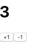
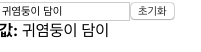
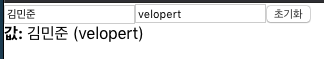
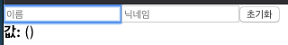
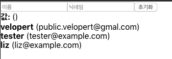
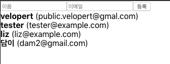
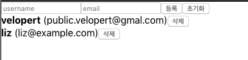

### [문제 01-01] 다음 그림과 같은 카운터를 만들어라.



```javascript
import React, { useState } from "react";

function Counter() {
  // number 라는 상태를 만들건데 상태의 기본값은 0을 하겠다.
  // setNumber는 상태를 바꿔주는 함수
  const [number, setNumber] = useState(0);

  const onIncrease = () => {
    setNumber((prevNumer) => prevNumer + 1);
  };

  const onDecrease = () => {
    setNumber((prevNumer) => prevNumer - 1);
  };
  return (
    <div>
      <h1>{number}</h1>
      <button onClick={onIncrease}>+1</button>
      <button onClick={onDecrease}>-1</button>
    </div>
  );
}

export default Counter;
```

```javascript
import React from "react";
import Counter from "./Counter";

function App() {
  return <Counter />;
}

export default App;
```

### [문제 01-02]



- input box에 데이터를 입력하면 데이터가 써짐
- 초기화 버튼을 누리면 데이터가 지워짐

```javascript
import React, { useState } from "react";

function InputSample() {
  const [text, setText] = useState("");

  const onChange = (e) => {
    setText(e.target.value);
  };

  const onReset = () => {
    setText("");
  };

  return (
    <div>
      <input onChange={onChange} value={text} />
      <button onClick={onReset}>초기화</button>
      <div>
        <b>값: </b>
        {text}
      </div>
    </div>
  );
}

export default InputSample;
```

```javascript
import React from "react";
import InputSample from "./InputSample";

function App() {
  return (
    <>
      <InputSample />
    </>
  );
}

export default App;
```

### [문제 01-03]



- input 2개
- 일름과 닉네임을 입력하면 아래 출력된다.
- 초기화 버튼을 누르면 내용이 리셋된다.

```javascript
import React, { useState } from "react";

const InputSample = () => {
  const [inputs, setInputs] = useState({
    name: "",
    nickname: "",
  });

  const { name, nickname } = inputs;

  const onChange = (e) => {
    const { name, value } = e.target;
    setInputs({ ...inputs, [name]: value });
    console.log(e.target.name);
    console.log(e.target.value);
  };
  const onReset = () => {
    setInputs({
      name: "",
      nickanme: "",
    });
  };
  return (
    <>
      <div>
        <input
          name="name"
          placeholder="이름"
          onChange={onChange}
          value={name}
        />
        <input
          name="nickname"
          placeholder="닉네임"
          onChange={onChange}
          value={nickname}
        />
        <button onClick={onReset}>초기화</button>
      </div>
      <div>
        <b>값: </b>
        {name} ({nickname})
      </div>
    </>
  );
};

export default InputSample;

```

```javascript
import React from "react";
import InputSample from "./InputSample";

function App() {
  return (
    <>
      <InputSample />
    </>
  );
}

export default App;

```

### [문제 01-04]

- 초기화 버튼을 눌렀더니 포커스가 이름 인풋으로 갔다.
  


```javascript
import React, { useState, useRef } from "react";

const InputSample = () => {
  const [inputs, setInputs] = useState({
    name: "",
    nickname: "",
  });

  const { name, nickname } = inputs;

  const nameInput = useRef();

  const onChange = (e) => {
    const { name, value } = e.target;
    setInputs({ ...inputs, [name]: value });
  };

  const onReset = () => {
    setInputs({
      name: "",
      nickanme: "",
    });
    nameInput.current.focus();
  };

  return (
    <div>
      <input
        name="name"
        onChange={onChange}
        value={name}
        placeholder="이름"
        ref={nameInput}
      />
      <input
        name="nickname"
        onChange={onChange}
        value={nickname}
        placeholder="닉네임"
      />
      <button onClick={onReset}>초기화</button>
      <div>
        <b>값: </b>
        {name} ({nickname})
      </div>
    </div>
  );
};

export default InputSample;
```

```javascript
import React from "react";
import InputSample from "./InputSample";
function App() {
  return <InputSample />;
}

export default App;
```


### [문제 01-05]

- 다음 데이터를 가지고 화면과 같이 출력해 보기.
  


```javascript
const users = [
  {
    id: 1,
    username: "velopert",
    email: "public.velopert@gmal.com",
  },
  {
    id: 2,
    username: "tester",
    email: "tester@example.com",
  },
  {
    id: 3,
    username: "liz",
    email: "liz@example.com",
  },
];
```

```javascript
import React from "react";

const User = ({ user }) => {
  return (
    <div>
      <b>{user.username}</b> <span>({user.email})</span>
    </div>
  );
};
const UserList = () => {
  const users = [
    {
      id: 1,
      username: "velopert",
      email: "public.velopert@gmal.com",
    },
    {
      id: 2,
      username: "tester",
      email: "tester@example.com",
    },
    {
      id: 3,
      username: "liz",
      email: "liz@example.com",
    },
  ];

  return users.map((user) => <User user={user} key={user.id} />);
};

export default UserList;
```

### [문제 01-05]

- 데이터를 등록하면 등록된 데이터가 화면에 추가된다.
  


```javascript
import React from "react";

const CreateUser = ({ username, email, onChange, onCreate }) => {
  return (
    <div>
      <input
        name="username"
        onChange={onChange}
        value={username}
        placeholder="이름"
      />
      <input
        name="email"
        onChange={onChange}
        value={email}
        placeholder="이메일"
      />
      <button onClick={onCreate}>등록</button>
    </div>
  );
};
export default CreateUser;
```

```javascript
import React, { useState, useRef } from "react";
import CreateUser from "./CreateUser";
import UserList from "./UserList";
const App = () => {
  const [inputs, setInputs] = useState({
    username: "",
    email: "",
  });
  const { username, email } = inputs;
  const [users, setUsers] = useState([
    {
      id: 1,
      username: "velopert",
      email: "public.velopert@gmal.com",
    },
    {
      id: 2,
      username: "tester",
      email: "tester@example.com",
    },
    {
      id: 3,
      username: "liz",
      email: "liz@example.com",
    },
  ]);

  const nextId = useRef(4); // 컴포넌트가 리렌더링 되도 기억된다.

  const onCreate = () => {
    console.log(nextId.current); // 4

    setUsers([...users, { id: nextId.current, username, email }]);
    // setUsers(users.concat(user));
    setInputs({
      username: "",
      email: "",
    });

    nextId.current += 1; // 값을변경한다. 값이 바뀌어도 컴포넌트가 리렌더링 되지 않는다.
  };

  const onChange = (e) => {
    const { name, value } = e.target;

    setInputs({ ...inputs, [name]: value });
  };
  return (
    <>
      <CreateUser
        username={username}
        email={email}
        onCreate={onCreate}
        onChange={onChange}
      />
      <UserList users={users} />
    </>
  );
};

export default App;


```

```javascript
import React from "react";

const UserList = ({ users }) => {
  return (
    <div>
      {users.map((user) => (
        <User user={user} key={user.id} />
      ))}
    </div>
  );
};

const User = ({ user }) => {
  return (
    <div>
      <b>{user.username}</b> ({user.email})
    </div>
  );
};
export default UserList;

```

### [문제 01-05]

- 삭제버튼을 누르면 데이터가 삭제된다.
  

```javascript
import React from "react";

const UserList = ({ users, onRemove }) => {
  return users.map((user) => (
    <User user={user} key={user.id} onRemove={onRemove} />
  ));
};

const User = ({ user, onRemove }) => {
  const { username, email, id } = user;
  return (
    <div>
      <b>{username}</b> ({email})
      <button
        type="button"
        onClick={() => {
          onRemove(id);
        }}
      >
        삭제
      </button>
    </div>
  );
};
export default UserList;

```
```javascript
import React, { useState, useRef } from "react";
import CreateUser from "./CreateUser";
import UserList from "./UserList";
const App = () => {
  const [inputs, setInputs] = useState({
    username: "",
    email: "",
  });
  const [users, setUsers] = useState([
    {
      id: 1,
      username: "velopert",
      email: "public.velopert@gmal.com",
    },
    {
      id: 2,
      username: "tester",
      email: "tester@example.com",
    },
    {
      id: 3,
      username: "liz",
      email: "liz@example.com",
    },
  ]);

  const onChange = (e) => {
    const { name, value } = e.target;

    setInputs({ ...inputs, [name]: value });
  };

  const onCreate = () => {
    setUsers([...users, { id: nextId.current++, ...inputs }]);
    setInputs({
      username: "",
      email: "",
    });
  };

  const { username, email } = inputs;
  const nameInput = useRef();
  const nextId = useRef(4);

  const onReset = () => {
    setInputs({ username: "", email: "" });
    nameInput.current.focus();
  };

  const onRemove = (id) => {
    setUsers(users.filter((user) => user.id !== id));
  };
  return (
    <div>
      <CreateUser
        onCreate={onCreate}
        onChange={onChange}
        username={username}
        email={email}
        onReset={onReset}
        nameInput={nameInput}
      />
      <UserList users={users} onRemove={onRemove} />
    </div>
  );
};

export default App;

```

```javascript
import React from "react";

const CreateUser = ({
  username,
  email,
  onChange,
  onCreate,
  onReset,
  nameInput,
}) => {
  return (
    <div>
      <input
        name="username"
        onChange={onChange}
        value={username}
        placeholder="username"
        ref={nameInput}
      />
      <input
        name="email"
        onChange={onChange}
        value={email}
        placeholder="email"
      />
      <button onClick={onCreate}>등록</button>
      <button onClick={onReset}>초기화</button>
    </div>
  );
};
export default CreateUser;

```