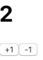
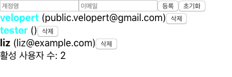

### [문제 01-01] 다음 그림과 같은 결과를 만들어라

- useReducer를 사용해서 Counter 렌더링 하기



```javascript
import React, { useReducer } from "react";

function reducer(state, actcion) {
  switch (actcion.type) {
    case "INCREMENT":
      return state + 1;
    case "DECREMENT":
      return state - 1;
    default:
      throw new Error("Unhandled action");
  }
}
const Counter = () => {
  // dispatch: 보내다. 액션을 발생시킨다. 라는 의미를 가지고 있다.
  const [number, dispatch] = useReducer(reducer, 0);
  const onIncrease = () => {
    dispatch({
      type: "INCREMENT",
    });
  };

  const onDecrease = () => {
    dispatch({
      type: "DECREMENT",
    });
  };
  return (
    <div>
      <h1>{number}</h1>
      <button onClick={onIncrease}>+1</button>
      <button onClick={onDecrease}>-1</button>
    </div>
  );
};

export default Counter;
```

```javascript
import React from "react";
import ReactDOM from "react-dom";
import "./index.css";
import App from "./App";
import Counter from "./Counter";
import * as serviceWorker from "./serviceWorker";

ReactDOM.render(
  <React.StrictMode>
    <Counter />
  </React.StrictMode>,
  document.getElementById("root")
);

// If you want your app to work offline and load faster, you can change
// unregister() to register() below. Note this comes with some pitfalls.
// Learn more about service workers: https://bit.ly/CRA-PWA
serviceWorker.unregister();
```

### [문제 01-02] 다음 그림과 같은 결과를 만들어라

- useReducer를 사용



```javascript
import React, { useReducer, useRef, useMemo, useCallback } from "react";
import CreateUser from "./CreateUser";
import UserList from "./UserList";

const countActiveUsers = (users) => {
  console.log("활성 사용자 수를 세는중...");
  return users.filter((user) => user.active).length;
};
// 첫번째. App 컴포넌트에서 사용할 초기 상태를 컴포넌트 밖에 선언해 준다.

/**
 * 어떨때 useReducer를 써야하고 useState를 써야 할까.
 * 컴포넌트에서 관리하는 값이 딱 하나고 값이 단순한 숫자 문자열 또는 불리언 값이라면은
 * 그런 경우에는 확실하게 useState로 관리하는게 편함.
 * 그런데 만약에 컴포넌트에서 관리하는 값이 여러개가 되어서
 * 상태의 구조가 복잡해 지거나
 * user를 배열에 뭘 추가해야할때도 있고 없애야 할때도 있고 그안에 있는 무언가를 바꿔야 할때도 있고
 * 그럴때는 useReducer를 편해 질 때도 있음.
 * useState, useReducer를 사용해 보고 마음에 드는 방식을 사용하면 됨.
 *
 * 세터를 한 함수에서 여러번 사용하는 일이 발생한다면 이때 부터 useReducer를 쓸가 고민을 시작함
 * setUsers(users => users.concat(user));
 * setInputs({
 *  username: '',
 *  email: ''
 * })
 *
 * 간단한거는 useState사용 좀 복잡하겠다 싶으면 useReducer사용하면됨.
 *
 *
 */
const initialState = {
  inputs: {
    username: "",
    email: "",
  },
  users: [
    {
      id: 1,
      username: "velopert",
      email: "public.velopert@gmail.com",
      active: true,
    },
    {
      id: 2,
      username: "tester",
      emai: "tester@gmail.com",
      active: false,
    },
    {
      id: 3,
      username: "liz",
      email: "liz@example.com",
      active: false,
    },
  ],
};

function reducer(state, action) {
  switch (action.type) {
    case "CHANGE_INPUT":
      return {
        ...state,
        inputs: {
          ...state.inputs,
          [action.name]: action.value,
        },
      };
    case "CREATE_USER":
      return {
        inputs: initialState.inputs,
        users: state.users.concat(action.user),
      };
    case "TOGGLE_USER":
      return {
        ...state,
        users: state.users.map((user) =>
          user.id === action.id ? { ...user, active: !user.active } : user
        ),
      };
    case "REMOVE_USER":
      return {
        ...state,
        users: state.users.filter((user) => user.id !== action.id),
      };
    default:
      throw new Error("Unhandled action");
  }
}
const App = () => {
  const [state, dispatch] = useReducer(reducer, initialState);
  const { users } = state;
  const nextId = useRef(4);
  const { username, email } = state.inputs;

  const onChange = useCallback((e) => {
    const { name, value } = e.target;
    dispatch({
      type: "CHANGE_INPUT",
      name,
      value,
    });
  }, []);

  const onCreate = useCallback(() => {
    dispatch({
      type: "CREATE_USER",
      user: {
        id: nextId.current,
        username,
        email,
      },
    });
    nextId.current += 1;
  }, [username, email]);

  const onToggle = useCallback((id) => {
    dispatch({
      type: "TOGGLE_USER",
      id,
    });
  }, []);

  const onRemove = useCallback((id) => {
    dispatch({
      type: "REMOVE_USER",
      id,
    });
  }, []);

  const count = useMemo(() => countActiveUsers(users), [users]);

  return (
    <>
      <CreateUser
        username={username}
        email={email}
        onChange={onChange}
        onCreate={onCreate}
      />
      <UserList users={users} onToggle={onToggle} onRemove={onRemove} />
      <div>활성 사용자 수: {count}</div>
    </>
  );
};

export default App;
```

```javascript
import React, { useEffect } from "react";

const User = React.memo(function ({ user, onToggle, onRemove }) {
  console.log("User");
  const { id, username, email, active } = user;

  return (
    <div>
      <b
        onClick={() => onToggle(id)}
        style={{
          color: active ? "aqua" : "black",
        }}
      >
        {username}
      </b>{" "}
      ({email})
      <button type="button" onClick={() => onRemove(id)}>
        삭제
      </button>
    </div>
  );
});

const UserList = ({ users, onToggle, onRemove }) => {
  return users.map((user) => (
    <User user={user} key={user.id} onToggle={onToggle} onRemove={onRemove} />
  ));
};

export default React.memo(
  UserList,
  (prevProps, nextProps) => nextProps.users === prevProps.props
); // 나머지 프롭스가 고정적이라서 비교할 필요없어서 users만 가지고 리렌더링할지 않할지 판단.
// users가 같으면 리렌더링 하지 않고 다르면 리렌더링 하겠다는 의미

```
```javascript
import React from "react";

const CreateUser = ({ username, email, onChange, onCreate, onReset }) => {
  console.log("CreateUser");
  return (
    <>
      <input
        name="username"
        placeholder="계정명"
        value={username}
        onChange={onChange}
      />
      <input
        name="email"
        placeholder="이메일"
        value={email}
        onChange={onChange}
      />
      <button type="button" onClick={onCreate}>
        등록
      </button>
      <button type="reset" onClick={onReset}>
        초기화
      </button>
    </>
  );
};

export default React.memo(CreateUser);

```
