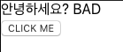

### [문제 01-01] ContextAPI 사용



- CLINK ME를 클릭하면 good, bad로 바뀜

```javascript
import React, { createContext, useContext, useState } from "react";

const MyContext = createContext("defaultValue");
function Child() {
  const text = useContext(MyContext); // useContextx는 context 에 있는 값을 읽어와서 사용할수 있게 해주는 리액트 내장된 훅
  return <div>안녕하세요? {text}</div>;
}

function Parent() {
  return <Child />;
}

function GrandParent() {
  return <Parent />;
}

function ContextSample() {
  const [value, setValue] = useState(true);
  return (
    <MyContext.Provider value={value ? "GOOD" : "BAD"}>
      <GrandParent />
      <button onClick={() => setValue(!value)}>CLICK ME</button>
    </MyContext.Provider>
  );
}

export default ContextSample;
```

```javascript
import React from "react";
import ReactDOM from "react-dom";
import "./index.css";
import App from "./App";
import * as serviceWorker from "./serviceWorker";
import ContextSample from "./ContextSample";

ReactDOM.render(
  <React.StrictMode>
    <ContextSample />
  </React.StrictMode>,
  document.getElementById("root")
);

// If you want your app to work offline and load faster, you can change
// unregister() to register() below. Note this comes with some pitfalls.
// Learn more about service workers: https://bit.ly/CRA-PWA
serviceWorker.unregister();
```

### [문제 01-02] ContextAPI 사용

```javascript
import { useReducer, useCallback } from "react";

// useState대신에 useReducer를 사용해 구현해보자.
function reducer(state, action) {
  switch (action.type) {
    case "CHANGE":
      return { ...state, [action.name]: action.value };
    case "RESET":
      return Object.keys(state).reduce((acc, current) => {
        acc[current] = "";
        return acc;
      }, {});
    default:
      throw state;
  }
}
function useInputs(initialForm) {
  const [form, dispatch] = useReducer(reducer, initialForm);

  const onChange = useCallback((e) => {
    const { name, value } = e.target;
    dispatch({ type: "CHANGE", name, value });
  }, []);

  const reset = useCallback(() => dispatch({ type: "RESET" }), []);

  return [form, onChange, reset];
}

export default useInputs;
```

```javascript
import React, {
  useReducer,
  useRef,
  useMemo,
  useCallback,
  createContext,
} from "react";
import CreateUser from "./CreateUser";
import UserList from "./UserList";
import useInputs from "./useInputs";

const countActiveUsers = (users) => {
  console.log("활성 사용자 수를 세는중...");
  return users.filter((user) => user.active).length;
};

const initialState = {
  users: [
    {
      id: 1,
      username: "velopert",
      email: "public.velopert@gmail.com",
      active: true,
    },
    {
      id: 2,
      username: "tester",
      emai: "tester@gmail.com",
      active: false,
    },
    {
      id: 3,
      username: "liz",
      email: "liz@example.com",
      active: false,
    },
  ],
};

function reducer(state, action) {
  switch (action.type) {
    case "CREATE_USER":
      return {
        inputs: initialState.inputs,
        users: state.users.concat(action.user),
      };
    case "TOGGLE_USER":
      return {
        ...state,
        users: state.users.map((user) =>
          user.id === action.id ? { ...user, active: !user.active } : user
        ),
      };
    case "REMOVE_USER":
      return {
        ...state,
        users: state.users.filter((user) => user.id !== action.id),
      };
    default:
      throw new Error("Unhandled action");
  }
}

export const UserDispatch = createContext(null);
const App = () => {
  const [state, dispatch] = useReducer(reducer, initialState);
  const [form, onChange, reset] = useInputs({ username: "", email: "" });
  const { username, email } = form;
  const { users } = state;
  const nextId = useRef(4);

  const onCreate = useCallback(() => {
    dispatch({
      type: "CREATE_USER",
      user: {
        id: nextId.current,
        username,
        email,
      },
    });
    nextId.current += 1;
    reset();
  }, [username, email, reset]);

  const count = useMemo(() => countActiveUsers(users), [users]);

  return (
    <UserDispatch.Provider value={dispatch}>
      <CreateUser
        username={username}
        email={email}
        onChange={onChange}
        onCreate={onCreate}
      />
      <UserList users={users} />
      <div>활성 사용자 수: {count}</div>
    </UserDispatch.Provider>
  );
};

export default App;
```

```javascript
import React, { useContext } from "react";
import { UserDispatch } from "./App";

const User = React.memo(function ({ user }) {
  console.log("User");
  const { id, username, email, active } = user;
  const dispatch = useContext(UserDispatch);

  return (
    <div>
      <b
        onClick={() => dispatch({ type: "TOGGLE_USER", id })}
        style={{
          color: active ? "aqua" : "black",
        }}
      >
        {username}
      </b>{" "}
      ({email})
      <button
        type="button"
        onClick={() => dispatch({ type: "REMOVE_USER", id })}
      >
        삭제
      </button>
    </div>
  );
});

const UserList = ({ users }) => {
  return users.map((user) => <User user={user} key={user.id} />);
};

export default React.memo(
  UserList,
  (prevProps, nextProps) => nextProps.users === prevProps.props
); // 나머지 프롭스가 고정적이라서 비교할 필요없어서 users만 가지고 리렌더링할지 않할지 판단.
// users가 같으면 리렌더링 하지 않고 다르면 리렌더링 하겠다는 의미
```

```javascript
import React from "react";

const CreateUser = ({ username, email, onChange, onCreate, onReset }) => {
  console.log("CreateUser");
  return (
    <>
      <input
        name="username"
        placeholder="계정명"
        value={username}
        onChange={onChange}
      />
      <input
        name="email"
        placeholder="이메일"
        value={email}
        onChange={onChange}
      />
      <button type="button" onClick={onCreate}>
        등록
      </button>
      <button type="reset" onClick={onReset}>
        초기화
      </button>
    </>
  );
};

export default React.memo(CreateUser);
```

### [문제 01-03] ContextAPI 사용

/hooks/useInput.ks

```javascript
import { useState, useCallback } from "react";

function useInputs(initialForm) {
  const [form, setForm] = useState(initialForm);
  // change
  const onChange = useCallback((e) => {
    const { name, value } = e.target;
    setForm((form) => ({ ...form, [name]: value }));
  }, []);
  const onReset = useCallback(() => setForm(initialForm), [initialForm]);
  return [form, onChange, onReset];
}

export default useInputs;
```

```javascript
import React, { useReducer, useMemo } from "react";
import UserList from "./UserList";
import CreateUser from "./CreateUser";

function countActiveUsers(users) {
  console.log("활성 사용자 수를 세는중...");
  return users.filter((user) => user.active).length;
}

const initialState = {
  users: [
    {
      id: 1,
      username: "velopert",
      email: "public.velopert@gmail.com",
      active: true,
    },
    {
      id: 2,
      username: "tester",
      email: "tester@example.com",
      active: false,
    },
    {
      id: 3,
      username: "liz",
      email: "liz@example.com",
      active: false,
    },
  ],
};

function reducer(state, action) {
  switch (action.type) {
    case "CREATE_USER":
      return {
        users: state.users.concat(action.user),
      };
    case "TOGGLE_USER":
      return {
        ...state,
        users: state.users.map((user) =>
          user.id === action.id ? { ...user, active: !user.active } : user
        ),
      };
    case "REMOVE_USER":
      return {
        ...state,
        users: state.users.filter((user) => user.id !== action.id),
      };
    default:
      return state;
  }
}

// UserDispatch 라는 이름으로 내보내줍니다.
export const UserDispatch = React.createContext(null);

function App() {
  const [state, dispatch] = useReducer(reducer, initialState);

  const { users } = state;

  const count = useMemo(() => countActiveUsers(users), [users]);
  return (
    <UserDispatch.Provider value={dispatch}>
      <CreateUser />
      <UserList users={users} />
      <div>활성사용자 수 : {count}</div>
    </UserDispatch.Provider>
  );
}

export default App;
```

```javascript
import React, { useRef, useContext } from "react";
import useInputs from "./hooks/useInputs";
import { UserDispatch } from "./App";

const CreateUser = () => {
  const [{ username, email }, onChange, reset] = useInputs({
    username: "",
    email: "",
  });

  const nextId = useRef(4);
  const dispatch = useContext(UserDispatch);

  const onCreate = () => {
    dispatch({
      type: "CREATE_USER",
      user: {
        id: nextId.current,
        username,
        email,
      },
    });
    reset();
    nextId.current += 1;
  };

  return (
    <div>
      <input
        name="username"
        placeholder="계정명"
        onChange={onChange}
        value={username}
      />
      <input
        name="email"
        placeholder="이메일"
        onChange={onChange}
        value={email}
      />
      <button onClick={onCreate}>등록</button>
    </div>
  );
};

export default React.memo(CreateUser);
```

```javascript
import React, { useContext } from "react";
import { UserDispatch } from "./App";

const User = React.memo(function User({ user }) {
  const dispatch = useContext(UserDispatch);

  return (
    <div>
      <b
        style={{
          cursor: "pointer",
          color: user.active ? "green" : "black",
        }}
        onClick={() => {
          dispatch({ type: "TOGGLE_USER", id: user.id });
        }}
      >
        {user.username}
      </b>
      &nbsp;
      <span>({user.email})</span>
      <button
        onClick={() => {
          dispatch({ type: "REMOVE_USER", id: user.id });
        }}
      >
        삭제
      </button>
    </div>
  );
});

function UserList({ users }) {
  return (
    <div>
      {users.map((user) => (
        <User user={user} key={user.id} />
      ))}
    </div>
  );
}

export default React.memo(UserList); // 두번째 파라미터를 지웠습니다
```
