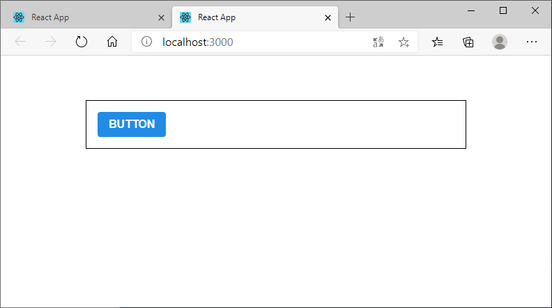

### [문제 01-01] 클래스형 컴포넌트



```javascript
import React, { Component } from "react";

class Hello extends Component {
  static defaultProps = {
    name: "이름없음",
  };

  render() {
    const { color, isSpecial, name } = this.props;
    return (
      <div style={{ color }}>
        {isSpecial && <b>*</b>}
        안녕하세요 {name}
      </div>
    );
  }
}

Hello.defaultProps = {
  name: "이름없음",
};

export default Hello;
```

```javascript
import React from "react";
import ReactDOM from "react-dom";
import "./index.css";
import App from "./App";
import * as serviceWorker from "./serviceWorker";
import ContextSample from "./ContextSample";
import Hello from "./Hello";

ReactDOM.render(
  <React.StrictMode>
    <Hello name="react" isSpecial color="red" />
  </React.StrictMode>,
  document.getElementById("root")
);

// If you want your app to work offline and load faster, you can change
// unregister() to register() below. Note this comes with some pitfalls.
// Learn more about service workers: https://bit.ly/CRA-PWA
serviceWorker.unregister();

```

### [문제 01-01] 카운터 클래스형 컴포넌트


```javascript
import React, { Component } from "react";

class Counter extends Component {
  // constructor(props) {
  //   super(props);
  //   this.handleIncrease = this.handleIncrease.bind(this);
  //   this.handleDecrease = this.handleDecrease.bind(this);
  // }

  // constructor(props) {
  //   super(props);
  //   this.state = {
  //     counter: 0,
  //   };
  // }

  state = {
    counter: 0,
  };
  handleIncrease = () => {
    console.log(this);
    console.log("increase");
    this.setState({
      counter: this.state.counter + 1,
    });
  };

  handleDecrease = () => {
    console.log("decrease");
    this.setState({
      counter: this.state.counter - 1,
    });
  };
  render() {
    return (
      <div>
        <h1>{this.state.counter}</h1>
        <button onClick={this.handleIncrease}>+1</button>
        <button onClick={this.handleDecrease}>-1</button>
      </div>
    );
  }
}
export default Counter;
```