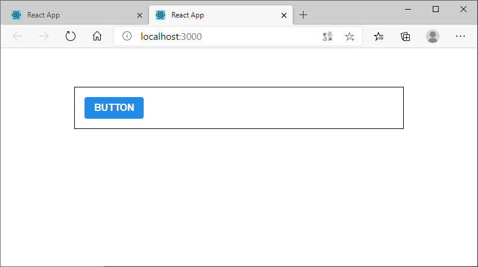

### [문제 01-01] 다음 그림과 같은 결과를 만들어라



```javascript
import React from 'react';
import Button from './components/Button';
import './App.scss';

function App() {
  return (
    <div className="App">
      <div className="buttons">
        <Button>BUTTON</Button>
      </div>
    </div>
  );
}

export default App;
```

```javascript
import React from 'react';
import './Button.scss';


function Button({children}) {
  return (
    <button className="Button">{children}</button>
  )
}

export default Button;
```


```scss
$blue: #228be6; // 주석!

//
.Button {
  display: inline-flex;
  align-items: center;
  color: #fff;
  font-weight: bold;
  outline: none;
  border-radius: 4px;
  border: none;
  cursor: pointer;

  height: 2.25rem; /* 2.25 * 16 = 36 */
  padding-left: 1rem;
  padding-right: 1rem;
  font-size: 1rem;

  background: $blue;

  &:hover {
    background: lighten($blue, 10%);
  }
  &:active {
    background: darken($blue, 10%);
  }
}
```

```scss
.App {
  width: 512px;
  margin: 0 auto;
  margin-top: 4rem;
  border: 1px solid black;
  padding: 1rem;
}
```