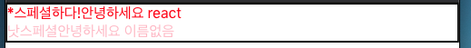

### [문제 01-01] 다음을 출력하는 Hello 컴포넌트를 작성하여라.


```javascript
import React from "react";

const Hello = () => {
  return <div>안녕하세요</div>;
};

export default Hello;
```

```javascript
import React from "react";
import Hello from "./Hello";

function App() {
  return (
    <>
      <Hello />
      <Hello />
      <Hello />
    </>
  );
}

export default App;
```

### [문제 01-02] 다음을 출력하는 컴포넌트를 작성하여라.

- JSX를 연습한다.
- 여러 엘리면트를 조회해 본다.
- style을 넣어본다.
- 클래스를 추가해 본다.
- 자바스크립트 변수를 출력해 본다.
- 주석을 사용해 본다. /\*\*/ //


```javascript
import React from "react";

const Hello = ({ name }) => {
  return (
    <div
      style={{
        color: "aqua",
        backgroundColor: "black",
        padding: "10px",
      }}
    >
      안녕하세요 {name}
    </div>
  );
};

export default Hello;
```

```javascript
import React from "react";
import Hello from "./Hello";
import "./App.css";

function App() {
  const name = "react";
  return (
    <>
      <Hello name={name} />
      <div className="gray-box"></div>
    </>
  );
}

export default App;
```

### [문제 01-02]

- 프롭스 사용
- 프롭스 칠드런 사용
- 디폴트 프롭스 사용
- 컴포넌트: App, Hello, Wrapper


```javascript
import React from "react";

const Hello = ({ name, color }) => {
  return <div style={{ color }}>안녕하세요 {name}</div>;
};

Hello.defaultProps = {
  name: "이름없음",
};
export default Hello;
```

```javascript
import React from "react";

const Wrapper = ({ children }) => {
  return (
    <div
      style={{
        border: "2px solid black",
      }}
    >
      {children}
    </div>
  );
};

export default Wrapper;
```

```javascript
import React from "react";
import Hello from "./Hello";
import Wrapper from "./Wrapper";

import "./App.css";

function App() {
  const name = "react";
  return (
    <Wrapper>
      <Hello name={name} color="red" />
      <Hello color="pink" />
    </Wrapper>
  );
}

export default App;
```

### [문제 01-04]

- boolean 값을 넘겨서 \* 출력
- boolean 값이 true면 스페셜! false면 낫스페셜 출력



```javascript
import React from "react";

const Hello = ({ name, color, isSpecial }) => {
  return (
    <div style={{ color }}>
      {isSpecial && "*"}
      {isSpecial ? "스페셜하다!" : "낫스페셜"}
      안녕하세요 {name}
    </div>
  );
};

Hello.defaultProps = {
  name: "이름없음",
};
export default Hello;
```

```javascript
import React from "react";

const Wrapper = ({ children }) => {
  return <div style={{ border: "2px solid black" }}>{children}</div>;
};

export default Wrapper;
```

```javascript
import React from "react";
import Hello from "./Hello";
import Wrapper from "./Wrapper";
import "./App.css";

function App() {
  return (
    <Wrapper>
      <Hello name="react" color="red" isSpecial />
      <Hello color="pink" />
    </Wrapper>
  );
}

export default App;
```
