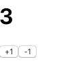
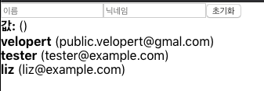

### [문제 01-01] 다음 그림과 같은 카운터를 만들어라.



```javascript
import React, { useState } from "react";

const Counter = () => {
  const [number, setNumber] = useState(0);

  const onIncrease = () => {
    setNumber((prevNumber) => prevNumber + 1);
  };

  const onDecrease = () => {
    setNumber((prevNumber) => prevNumber - 1);
  };
  return (
    <div>
      <h1>{number}</h1>
      <button onClick={onIncrease}>+1</button>
      <button onClick={onDecrease}>-1</button>
    </div>
  );
};

export default Counter;
```

```javascript
import React from "react";
import Counter from "./Counter";
function App() {
  return (
    <>
      <Counter />
    </>
  );
}

export default App;
```

### [문제 01-02]


- input box에 데이터를 입력하면 데이터가 써짐
- 초기화 버튼을 누리면 데이터가 지워짐

```javascript
import React, { useState } from "react";

const InputSample = () => {
  const [text, setText] = useState("");
  const onChange = (e) => {
    setText(e.target.value);
  };

  const onReset = () => {
    setText("");
  };
  return (
    <>
      <div>
        <input value={text} onChange={onChange} />
        <button onClick={onReset}>초기화</button>
      </div>
      <div>
        <b>값: </b>
        {text}
      </div>
    </>
  );
};

export default InputSample;
```

```javascript
import React from "react";
import InputSample from "./InputSample";

function App() {
  return (
    <>
      <InputSample />
    </>
  );
}

export default App;
```

### [문제 01-03]

- 이름, 닉네임을 입력받아서 인풋내용을 출력
- 초기화 버튼을 클릭하면 리셋됨


```javascript
import React, { useState } from "react";

const InputSample = () => {
  const [inputs, setInputs] = useState({
    name: "",
    nickname: "",
  });

  const { name, nickname } = inputs;

  const onChange = (e) => {
    const { name, value } = e.target;
    setInputs({ ...inputs, [name]: value });
  };

  const onReset = () => {
    setInputs({
      name: "",
      nickanme: "",
    });
  };
  return (
    <div>
      <input name="name" onChange={onChange} value={name} placeholder="이름" />
      <input
        name="nickname"
        onChange={onChange}
        value={nickname}
        placeholder="닉네임"
      />
      <button onClick={onReset}>초기화</button>
      <div>
        <b>값: </b>
        {name} ({nickname})
      </div>
    </div>
  );
};

export default InputSample;

```

```javascript
import React from "react";
import InputSample from "./InputSample";
function App() {
  return <InputSample />;
}

export default App;
```


### [문제 01-04]

- 초기화 버튼을 눌렀더니 포커스가 이름 인풋으로 갔다.
  


```javascript
import React, { useState, useRef } from "react";

const InputSample = () => {
  const [inputs, setInputs] = useState({
    name: "",
    nickname: "",
  });

  const { name, nickname } = inputs;

  const nameInput = useRef();

  const onChange = (e) => {
    const { name, value } = e.target;
    setInputs({ ...inputs, [name]: value });
  };

  const onReset = () => {
    setInputs({
      name: "",
      nickanme: "",
    });
    nameInput.current.focus();
  };

  return (
    <div>
      <input
        name="name"
        onChange={onChange}
        value={name}
        placeholder="이름"
        ref={nameInput}
      />
      <input
        name="nickname"
        onChange={onChange}
        value={nickname}
        placeholder="닉네임"
      />
      <button onClick={onReset}>초기화</button>
      <div>
        <b>값: </b>
        {name} ({nickname})
      </div>
    </div>
  );
};

export default InputSample;
```

```javascript
import React from "react";
import InputSample from "./InputSample";
function App() {
  return <InputSample />;
}

export default App;
```

### [문제 01-05]

- 다음 데이터를 가지고 화면과 같이 출력해 보기.
  


```javascript
import React from "react";

const UserList = () => {
  const users = [
    {
      id: 1,
      username: "velopert",
      email: "public.velopert@gmal.com",
    },
    {
      id: 2,
      username: "tester",
      email: "tester@example.com",
    },
    {
      id: 3,
      username: "liz",
      email: "liz@example.com",
    },
  ];

  return (
    <div>
      {users.map((user) => (
        <User user={user} key={user.id} />
      ))}
    </div>
  );
};

const User = ({ user }) => {
  return (
    <div>
      <b>{user.username}</b> ({user.email})
    </div>
  );
};
export default UserList;
```

```javascript
import React from "react";
import InputSample from "./InputSample";
import UserList from "./UserList";
const App = () => {
  return (
    <>
      <InputSample />
      <UserList />
    </>
  );
};

export default App;

```

```javascript
import React, { useState, useRef } from "react";

const InputSample = () => {
  const [inputs, setInputs] = useState({
    name: "",
    nickname: "",
  });

  const onChange = (e) => {
    const { name, value } = e.target;
    setInputs({ ...inputs, [name]: value });
  };

  const onReset = () => {
    setInputs({
      name: "",
      nickname: "",
    });
    nameInput.current.focus();
  };

  const { name, nickname } = inputs;

  const nameInput = useRef();
  return (
    <>
      <input name="name" onChange={onChange} value={name} ref={nameInput} />
      <input name="nickname" onChange={onChange} value={nickname} />
      <button onClick={onReset}>초기화</button>
      <div>
        <b>값:</b>
        {name} ({nickname})
      </div>
    </>
  );
};
export default InputSample;

```