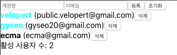

### [문제 01-01] 다음 그림과 같은 결과를 만들어라

- users 배열의 내용이 아래 리스트로 조회된다.
- 등록 버튼을 누르면 내용이 조회된다.
- 초기화를 누르면 input box의 값이 초기화 된다.
- 삭제 버튼을 누르면 해당 아이템이 삭제된다.
- 계정명을 클릭하면 해당 이름이 녹색으로 변한다.


```javascript
import React, { useState, useRef } from "react";
import CreateUser from "./CreateUser";
import UserList from "./UserList";

const App = () => {
  const [inputs, setInputs] = useState({
    username: "",
    email: "",
  });

  const { username, email } = inputs;

  const [users, setUsers] = useState([
    {
      id: 1,
      username: "velopert",
      email: "public.velopert@gmail.com",
      active: true,
    },
    {
      id: 2,
      username: "gyseo",
      email: "gyseo20@gmail.com",
      active: false,
    },
    {
      id: 3,
      username: "단이",
      email: "단이@gmail.com",
      active: false,
    },
  ]);

  const onToggle = (id) => {
    setUsers(
      users.map((user) =>
        id === user.id ? { ...user, active: !user.active } : user
      )
    );
  };

  const onRemove = (id) => {
    setUsers(
      users.filter((user) => {
        return user.id !== id;
      })
    );
  };

  const onCreate = () => {
    setUsers([...users, { id: nextId.current++, ...inputs }]);
    setInputs({
      username: "",
      email: "",
    });
  };

  const onReset = () => {
    setInputs({
      username: "",
      email: "",
    });
    nameInput.current.focus();
  };

  const onChange = (e) => {
    const { name, value } = e.target;
    setInputs({ ...inputs, [name]: value });
  };

  const nextId = useRef(4);

  const nameInput = useRef();
  return (
    <>
      <CreateUser
        username={username}
        email={email}
        onCreate={onCreate}
        onReset={onReset}
        onChange={onChange}
        nameInput={nameInput}
      />
      <UserList users={users} onToggle={onToggle} onRemove={onRemove} />
    </>
  );
};

export default App;

```

```javascript
import React from "react";

const UserList = ({ users, onToggle, onRemove }) => {
  console.log(users);
  return users.map((user) => (
    <User user={user} key={user.id} onToggle={onToggle} onRemove={onRemove} />
  ));
};

const User = ({ user, onToggle, onRemove }) => {
  const { id, username, email, active } = user;
  return (
    <div>
      <b
        onClick={() => onToggle(id)}
        style={{
          color: active ? "aqua" : "black",
        }}
      >
        {username}
      </b>{" "}
      ({email})
      <button type="button" onClick={() => onRemove(id)}>
        삭제
      </button>
    </div>
  );
};

export default UserList;

```

```javascript
import React from "react";

const CreateUser = ({
  username,
  email,
  onChange,
  onCreate,
  onReset,
  nameInput,
}) => {
  return (
    <>
      <input
        name="username"
        placeholder="계정명"
        value={username}
        onChange={onChange}
        ref={nameInput}
      />
      <input
        name="email"
        placeholder="이메일"
        value={email}
        onChange={onChange}
      />
      <button type="button" onClick={onCreate}>
        등록
      </button>
      <button type="reset" onClick={onReset}>
        초기화
      </button>
    </>
  );
};

export default CreateUser;

```

### [문제 01-02] users 데이터가 변경 될 때마다 user 컴포넌트를 다시 렌더링 하는데 user데이터 변경전 변경후에 console.log 찍기
```javascript
useEffect(() => {
  // 컴포넌트가 처음 나타날때 호출이 된다.
  console.log(user);
  return () => {
    // 컴포넌트가 사라질 때 호출이 된다.
  };
}, []);

useEffect(() => {
  // 컴포넌트가 처음 나타날때 호출이 된다.
  // user객체가 바뀔때 호출이 된다.
  console.log(user);
  return () => {
    // user 객체가 바뀌기 직전에 호출이 된다.
    // 컴포넌트가 사라지기 전에 호출이 된다.
  };
}, [users]);
```

```javascript
import React, { useEffect } from "react";

const User = ({ user, onToggle, onRemove }) => {
  const { id, username, email, active } = user;

  useEffect(() => {
    console.log("user값이 설정 됨", user);
    return () => {
      console.log("user값이 바뀌기 전", user);
    };
  }, [user]);

  return (
    <div>
      <b
        onClick={() => onToggle(id)}
        style={{
          color: active ? "aqua" : "black",
        }}
      >
        {username}
      </b>{" "}
      ({email})
      <button type="button" onClick={() => onRemove(id)}>
        삭제
      </button>
    </div>
  );
};

const UserList = ({ users, onToggle, onRemove }) => {
  return users.map((user) => (
    <User user={user} key={user.id} onToggle={onToggle} onRemove={onRemove} />
  ));
};

export default UserList;

```

### [문제 01-03] 다음 그림과 같은 결과를 만들어라

- 활성 사용자수 구하기
- users값이 변경되었을때만 연산을 수행하여 계산된 값을 가져오고 users값이 변경되지 않았을때는 이전에 계산된 값을 가져와서 컴포넌트 성능 최적화



```javascript
import React, { useState, useRef, useMemo } from "react";

const countActiveUsers = (users) => {
  console.log("활성 사용자 수를 세는중...");
  return users.filter((user) => user.active).length;
};

const count = useMemo(() => countActiveUsers(users), [users]);
```

```javascript
import React, { useState, useRef, useMemo } from "react";
import CreateUser from "./CreateUser";
import UserList from "./UserList";

const countActiveUsers = (users) => {
  console.log("활성 사용자 수를 세는중...");
  return users.filter((user) => user.active).length;
};
const App = () => {
  const [inputs, setInputs] = useState({
    username: "",
    email: "",
  });

  const { username, email } = inputs;

  const [users, setUsers] = useState([
    {
      id: 1,
      username: "velopert",
      email: "public.velopert@gmail.com",
      active: true,
    },
    {
      id: 2,
      username: "gyseo",
      email: "gyseo20@gmail.com",
      active: false,
    },
    {
      id: 3,
      username: "단이",
      email: "단이@gmail.com",
      active: false,
    },
  ]);

  const onToggle = (id) => {
    setUsers(
      users.map((user) =>
        id === user.id ? { ...user, active: !user.active } : user
      )
    );
  };

  const onRemove = (id) => {
    setUsers(
      users.filter((user) => {
        return user.id !== id;
      })
    );
  };

  const onCreate = () => {
    setUsers([...users, { id: nextId.current++, ...inputs }]);
    setInputs({
      username: "",
      email: "",
    });
  };

  const onReset = () => {
    setInputs({
      username: "",
      email: "",
    });
    nameInput.current.focus();
  };

  const onChange = (e) => {
    const { name, value } = e.target;
    setInputs({ ...inputs, [name]: value });
  };

  const nextId = useRef(4);

  const nameInput = useRef();

  const count = useMemo(() => countActiveUsers(users), [users]);
  return (
    <>
      <CreateUser
        username={username}
        email={email}
        onCreate={onCreate}
        onReset={onReset}
        onChange={onChange}
        nameInput={nameInput}
      />
      <UserList users={users} onToggle={onToggle} onRemove={onRemove} />
      <div>활성 사용자 수: {count}</div>
    </>
  );
};

export default App;

```